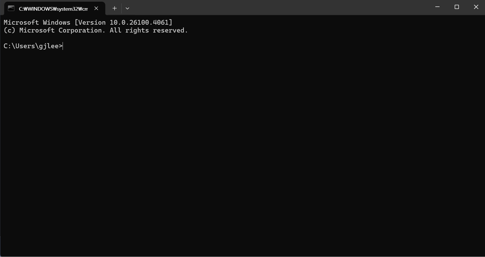
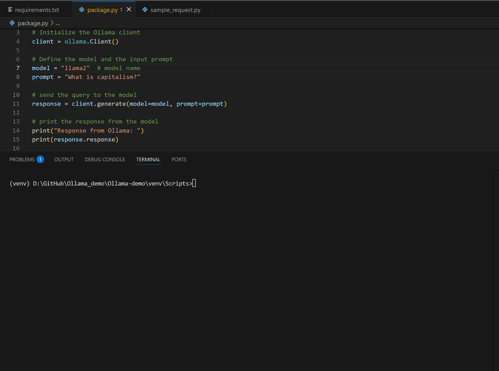
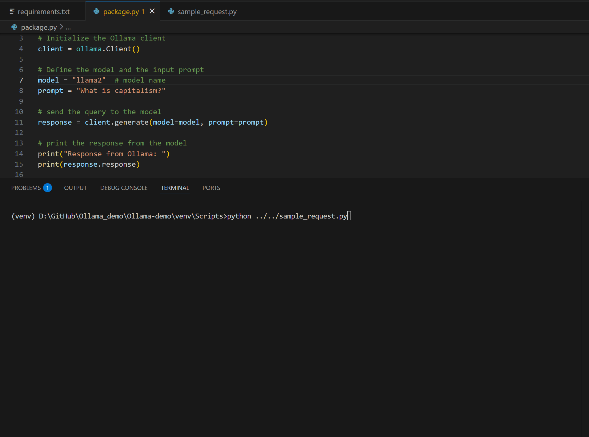

# Ollama Demo

A demonstration project showcasing local AI model deployment and interaction using Ollama.

## Demo Examples
### Custom AI agent (Jarvis)

### package.py (llama2, prompt = "What is capitalism?")

### sample.py (mistral, prompt = "What happened in Korea in 1950?")



## Prerequisites

- Python 3.10.11 
- Command line interface (Terminal/CMD)
- Internet connection for initial setup

## Installation

### 1. Install Ollama

1. Download the Ollama setup file from [https://ollama.com/](https://ollama.com/)
2. Run the installer and follow the installation instructions
3. Verify the installation by opening your command line interface and typing:
   ```bash
   ollama
   ```
   If Ollama is properly installed, you should see the help information.

### 2. Install AI Models

Install the required models for this demo:

```bash
ollama run mistral
ollama run llama2
ollama run llama3.2
```

**Note**: Model downloads may take some time depending on your internet connection, as these are large files.

### 3. Testing Model Installation

After installation, you can interact with any model directly:

```bash
ollama run mistral
```

- Ask questions and interact with the model locally
- To exit the model interface, type `/bye`

## Project Setup

### 1. Clone Repository

```bash
git clone [repository-url]
cd ollama-demo
```

### 2. Create Virtual Environment

```bash
# Create virtual environment
python -m venv venv

# Activate virtual environment
# On Windows:
venv\Scripts\activate

# On macOS/Linux:
source venv/bin/activate
```

### 3. Install Dependencies

```bash
pip install -r requirements.txt
```

## Usage

### Running the Demo

With your virtual environment activated, execute the following commands:

```bash
# Run the main package
python ../../package.py

# Run sample requests
python ../../sample_requests.py
```

### Creating Custom AI Agents

You can create custom AI agents using Modelfiles:

```bash
ollama create [custom-name] -f [Modelfile]
```

Replace `[custom-name]` with your desired agent name and `[Modelfile]` with the path to your Modelfile.

## Available Models

This demo includes the following pre-configured models:

- **Mistral**: A 7B parameter model optimized for instruction following
- **Llama2**: Meta's foundation model for general-purpose tasks
- **Llama3.2**: Latest version with improved performance and capabilities

## Troubleshooting

### Common Issues

1. **Ollama command not recognized**: Ensure Ollama is properly installed and added to your system PATH
2. **Model download fails**: Check your internet connection and available disk space
3. **Virtual environment issues**: Ensure you've activated the virtual environment before running Python scripts

### Getting Help

- Visit [Ollama Documentation](https://ollama.com/docs) for detailed guides
- Check model-specific documentation for advanced usage

## Project Structure

```
ollama-demo/
├── package.py
├── sample_requests.py
├── requirements.txt
├── README.md
└── venv/
```

## Contributing

Feel free to submit issues and enhancement requests to improve this demo.

## License

MIT lincence

---

**Note**: This demo is designed for local development and testing. Ensure you have sufficient system resources for running large language models locally.
